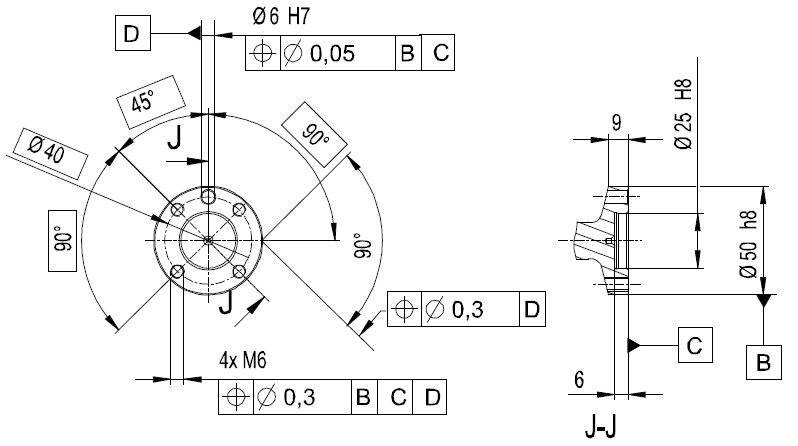
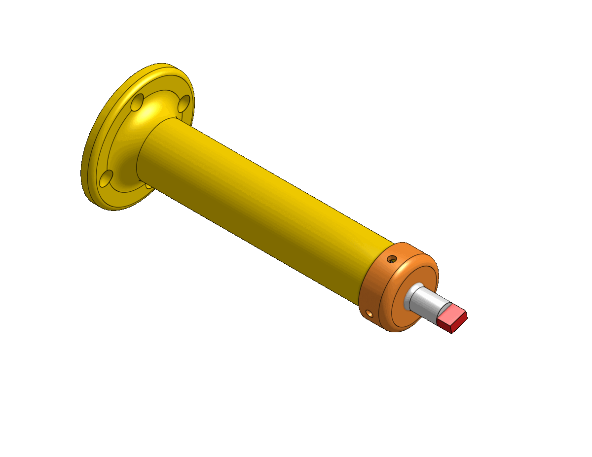

# robotics-lab1
Repositoty for practices with an industrial robot model ABB IRB140

> ## Contributors
> 
> - [Camilo Andrés Borda Gil](https://github.com/Canborda) (caabordagi@unal.edu.co)
> - Paula Sofía Medina Diaz (psmedinadi@unal.edu.co)
> - Robinson Jair Orduxz Gomez (rjorduzg@unal.edu.co)

---
# Tool Design

The goal was to draw on a defined surface with a self-designed tool. To achieve this, we searched on the [product manual](https://library.e.abb.com/public/81a35b138c2342b5b9455e5696a09484/3HAC027400%20PM%20IRB%20140-en.pdf) the dimensions of the mounting flange.

Based on those dimensions, the team designed the tool shown below, made up of four parts: a base and a cap build with 3D printing, a spring and a marker. To see the tool model with more detail go to <a target="_blank" href="https://cad.onshape.com/documents/02a2a5fe444c220951f7859a/w/4de4b01172907f48fb48adbe/e/481b6444fafd2e1357d20adc">Visualize CAD model with OnShape</a>.

The final tool has the following properties:
|   |   |
|---|---|
| __mass__ | $34g$ (parts) + $70g$ (marker) |
| __center of gravity__ | $[0, 0, 61]$ $\text{mm}$ |
| __TCP__ | $[0, 0, 145]$ $\text{mm}$ |

---